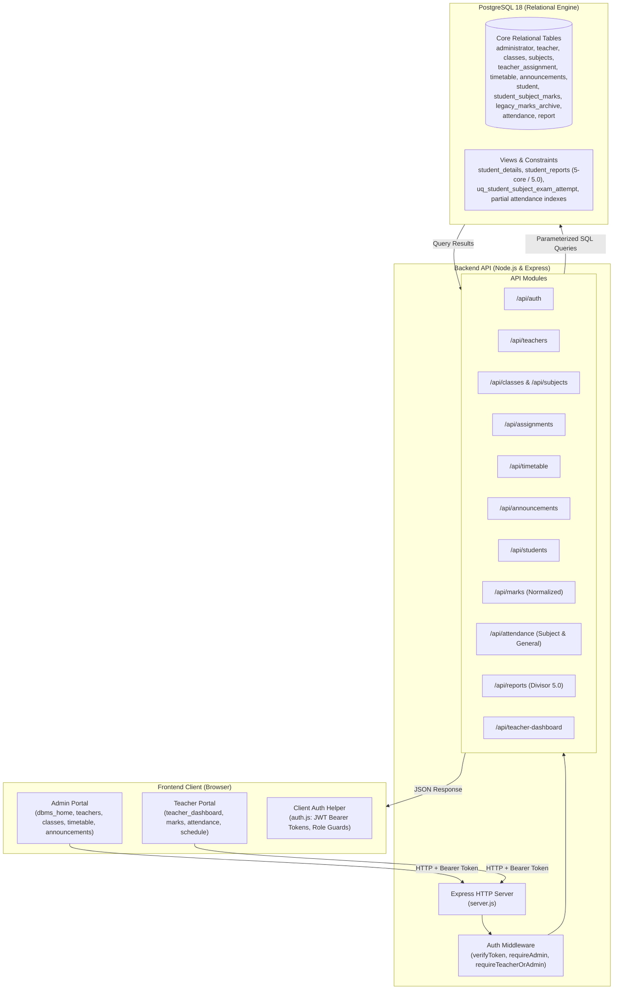

# School Management System

A full-stack School Management System developed as a DBMS project using **HTML, CSS, JavaScript, Node.js, Express.js, and PostgreSQL**.

The system provides modules for managing students, teachers, classes, subjects, timetables, normalized marks, subject-specific attendance, and academic reports through a browser-based interface backed by a PostgreSQL database.

---

## 1. Project Overview

The School Management System provides a centralized platform for managing essential student and academic information with fine-grained role-based permissions for Administrators and Teachers.

### Objectives

- Manage student records with safe dependency handling.
- Maintain a normalized, attempt-aware marks system across 5 core academic subjects.
- Support subject-specific attendance and period-level tracking while preserving legacy general attendance.
- Enforce strict teacher-level authorization (teachers can create, view, edit, and delete marks/attendance only for their assigned classes and subjects).
- Generate academic reports with stable identifiers and correct average calculations.
- Demonstrate advanced PostgreSQL database concepts: normalized tables, composite unique constraints, partial indexes, views, aggregations, and data-safe migrations.

---

## 2. Features

### Authentication & Role-Based Access Control (RBAC)
- Secure dual-role login (Administrator and Teacher)
- Password hashing with bcrypt (10 rounds)
- JWT token authentication with 8-hour expiry and fail-secure secret verification
- Automatic legacy plaintext password upgrade upon valid administrator login
- Role-based server-side API route guards (`requireAdmin`, `requireTeacher`, `requireTeacherOrAdmin`)
- Client-side navigation authorization with session preservation

### Teacher Management (Administrator)
- Add, view, search, and edit teacher profiles
- Status management (Active, Inactive, Suspended)
- Safe teacher deletion with foreign key dependency checks
- Tracks Teacher ID, full name, email, phone, qualification, specialization, and joining date

### Class, Subject & Assignment Management (Administrator)
- Class management: Add, list, search classes with academic year and capacity
- Subject catalog: Core 5 curriculum subjects (`FL101` First Language, `SL102` Second Language, `MTH103` Mathematics, `SCI104` Science, `ART105` Arts); retired legacy "Others" subject
- Faculty assignment: Assign teachers to specific class and subject pairings
- Duplicate assignment prevention (`uq_teacher_class_subject` constraint)
- Automatic mapping between student class strings and registered class records

### Teacher Dashboard (Faculty Portal)
- Personalized faculty overview: profile summary, assigned classes, and subjects
- Scoped student rosters: view students enrolled only in authorized classes
- Subject-specific attendance recording restricted to authorized class and subject pairings
- Normalized subject marks entry restricted to authorized subjects and classes
- Weekly teaching schedule / timetable display
- School notices and announcements board

### Timetable Management (Administrator & Teacher)
- Weekly schedule management by class, subject, teacher, day, and time slots
- Room assignment and slot management
- Double-booking / conflict prevention:
  - Class schedule conflict detection (`start_A < end_B AND end_A > start_B`)
  - Teacher schedule conflict detection preventing faculty double-booking
- Faculty schedule viewer (`/my-schedule`)

### Announcements & Notices
- Publish school-wide announcements with priority indicators (Urgent, High, Normal, Low)
- Target audience scoping (`All`, `Teachers`, `Students`)
- Active/inactive announcement status toggling
- Pinned and recent notice boards

### Student Management
- Add, edit, delete, and search students by registration number
- Student directory with live search and class filtering
- Profile details: contact info, date of birth, blood group, address
- Deletion safety: Verifies no dependent academic records (`student_subject_marks`, `attendance`, `report`) exist before deletion

### Normalized Marks Management
- Fully normalized marks schema (`student_subject_marks`) storing individual subject records per student, subject, exam, academic year, and retake attempt
- Retired legacy `others` column and `OTH106` subject across database, backend, frontend, and tests
- Preserved 100% of historical `others` marks in `legacy_marks_archive`
- Granular authorization: Teachers can create, view, edit, and delete marks only for students, classes, and subjects assigned to them; administrators retain global access
- Automatic report synchronization with stable `report_id` tracking

### Subject-Specific Attendance Management
- Granular subject-level attendance tracking (`attendance_type = 'Subject'`) referencing `subject_id` and optional timetable periods (`timetable_id`)
- Backward compatibility: Preserves all historical attendance records as `attendance_type = 'General'`
- Partial unique indexes prevent duplicates for General daily attendance, Subject daily attendance, and Subject period-based attendance
- Mutual consistency verification: Backend verifies teacher assignment and timetable consistency before recording or updating attendance
- Granular authorization: Teachers can create, view, edit, and delete attendance only for their assigned classes and subjects

### Extended Reports & Analytics
- Individual student report card with total marks, average across 5 core subjects (divisor `5.0`), and grade derivation
- Class-wise academic performance report pivoted dynamically from normalized marks
- Class attendance statistics and percentage distribution
- Teacher workload analysis (assigned classes, subjects, and weekly periods)
- Upgraded `student_reports` view with stable `report_id` join and divisor `5.0`

### Database Features
- Primary keys and Foreign keys with cascading integrity
- Composite UNIQUE constraints: `(reg_no, subject_id, exam_type, academic_year, attempt_number)` on marks; `(reg_no, exam_type, academic_year, attempt_number)` on canonical report sittings
- Partial UNIQUE indexes on attendance distinguishing General and Subject attendance
- CHECK constraints (mark ranges 0–100, attendance status enum, priority enum)
- Identity / auto-increment serial columns
- Data-safe migration (`002_normalize_marks_and_subject_attendance.sql`) and complete rollback script (`rollback_002_migration.sql`)

---

## 3. Tech Stack

### Frontend
- HTML5
- CSS3
- JavaScript (Vanilla ES6+)

### Backend
- Node.js
- Express.js

### Database
- PostgreSQL 18

### Tools
- Visual Studio Code
- Git & GitHub
- PostgreSQL / pgAdmin

---

## 4. Architecture



---

## 5. Project Structure

```text
school-managment-system-antigravity/
│
├── index.html                    # Common login portal (Administrator & Teacher tabs)
├── auth.js                       # Frontend auth helper (token store, SMS_AUTH.fetch, guards)
├── dbms.css                      # Global responsive stylesheet
│
├── dbms_home.html                # Administrator dashboard (metrics, stats, management hub)
├── teachers.html                 # Teacher management (CRUD, status, profiles)
├── classes.html                  # Academic management (Classes, Subjects, Assignments)
├── timetable.html                # Timetable scheduling (conflict & overlap prevention)
├── announcements.html            # School announcements publisher & audience filter
│
├── teacher_dashboard.html        # Scoped faculty dashboard (roster, quick subject attendance, marks, schedule)
│
├── add_student.html              # Add new student record
├── edit_student.html             # Edit existing student profile
├── delete_student.html           # Safely delete student record
├── student_search.html           # Student directory & class filter
│
├── enter_marks.html              # Enter student marks (5 core subjects)
├── edit_marks.html               # Edit student examination marks (5 core subjects)
├── delete_marks.html             # Delete subject mark records
│
├── add_attendance.html           # Subject-specific and general attendance logging
├── edit_attendance.html          # Edit attendance record
├── delete_attendance.html        # Delete attendance record
│
├── reports.html                  # Reports center (Individual, Class Performance, Class Attendance, Workloads)
│
├── backend/
│   ├── .env.example              # Safe environment variable template
│   ├── db.js                     # Configurable PostgreSQL connection pool
│   ├── package.json              # Express, pg, bcryptjs, jsonwebtoken, dotenv
│   ├── server.js                 # Express server with fail-secure startup check
│   ├── test_suite.js             # Offline project verification suite (unit & invariant tests)
│   ├── middleware/
│   │   └── auth.js               # JWT verification & role authorization middleware
│   └── routes/
│       ├── auth.js               # Dual-role authentication & token issuance
│       ├── teachers.js           # Teacher management CRUD & dependency validation
│       ├── classes.js            # Class CRUD & student count aggregation
│       ├── subjects.js           # Subject catalog CRUD & assignment check
│       ├── assignments.js        # Faculty assignment mapping & duplicate prevention
│       ├── timetable.js          # Timetable schedule & conflict detection
│       ├── announcements.js      # Announcement publishing & role scoping
│       ├── teacherDashboard.js   # Scoped endpoints for authenticated teachers
│       ├── students.js           # Student CRUD (dependency checks on student_subject_marks)
│       ├── marks.js              # Normalized marks CRUD & teacher assignment authorization
│       ├── attendance.js         # Subject & general attendance with mutual consistency
│       └── reports.js            # Reports querying student_reports view with divisor 5.0
│
├── database/
│   ├── schema.sql                # Base canonical schema definition (normalized marks, subject attendance)
│   ├── queries.sql               # Comprehensive SQL query demonstration script (25 sections)
│   └── migrations/
│       ├── 001_safe_schema_extensions.sql              # RBAC & academic entities extension
│       ├── 002_normalize_marks_and_subject_attendance.sql  # Marks normalization & subject attendance migration
│       └── rollback_002_migration.sql                  # Data-safe lossless rollback script
│
└── docs/
    ├── DB-Design.docx            # Original database design document
    └── screenshots/              # System demonstration screenshots
```

---

## 6. Installation & Setup

### Prerequisites

Install:
- Node.js (v18 or later)
- PostgreSQL (v15 or later, tested with PostgreSQL 18)
- Git

### 1. Project Directory

Ensure you are working in your project directory:

```bash
cd school-managment-system-antigravity
```

### 2. Configure Environment Variables

Create `backend/.env` based on `backend/.env.example`:

```env
# Database Configuration
DB_USER=postgres
DB_HOST=localhost
DB_NAME=school_management
DB_PORT=5432
DB_PASSWORD=your_actual_postgresql_password

# Server Port
PORT=5000

# Security (CRITICAL: Required for server to start)
JWT_SECRET=your_super_secret_jwt_key_change_this_in_production
```

> **Security Note:** The backend fails securely at startup if `JWT_SECRET` is missing. Never commit `.env` into version control.

### 3. Database Migrations

For new setups:
```sql
CREATE DATABASE school_management;
\c school_management
\i database/schema.sql
```

For existing databases with legacy data, apply migration `002`:
```sql
\c school_management
\i database/migrations/002_normalize_marks_and_subject_attendance.sql
```

To revert migration `002` if needed:
```sql
\c school_management
\i database/migrations/rollback_002_migration.sql
```

---

## 7. API Documentation

All protected routes require an `Authorization: Bearer <token>` HTTP header.

### Marks (`/api/marks`)

| Method | Endpoint | Access | Description |
| --- | --- | --- | --- |
| GET | `/api/marks` | Teacher / Admin | List marks (teachers scoped strictly to assigned classes and subjects). |
| POST | `/api/marks` | Teacher / Admin | Create or update marks (supports normalized single-subject or batch 5-core subjects; verifies teacher assignments). |
| GET | `/api/marks/:reg_no` | Teacher / Admin | Get marks for a student (scoped to assigned subjects for teachers). |
| PUT | `/api/marks/:mark_record_id` | Teacher / Admin | Update specific subject mark record (teachers restricted to assigned subjects). |
| DELETE | `/api/marks/:mark_record_id` | Teacher / Admin | Delete specific subject mark record (teachers restricted to assigned subjects; admin has global access). |

### Attendance (`/api/attendance`)

| Method | Endpoint | Access | Description |
| --- | --- | --- | --- |
| GET | `/api/attendance` | Teacher / Admin | List attendance records (teachers scoped to assigned classes/subjects; supports query filters). |
| POST | `/api/attendance` | Teacher / Admin | Record attendance (teachers must provide assigned `subject_id`; verifies mutual consistency with timetable; supports General attendance for admin). |
| GET | `/api/attendance/:reg_no` | Teacher / Admin | Get attendance for a student. |
| PUT | `/api/attendance/:attend_id` | Teacher / Admin | Update attendance status (teachers restricted to assigned subject attendance). |
| DELETE | `/api/attendance/:attend_id` | Teacher / Admin | Delete attendance record (teachers can delete assigned subject attendance; General attendance deletable only by admin). |

### Reports (`/api/reports`)

| Method | Endpoint | Access | Description |
| --- | --- | --- | --- |
| GET | `/api/reports` | Teacher / Admin | List student report cards from `student_reports` view. |
| GET | `/api/reports/:reg_no` | Teacher / Admin | Get report card for a student. |
| GET | `/api/reports/class-performance/:class_code` | Teacher / Admin | Class academic performance report across 5 core subjects (divisor 5.0). |
| GET | `/api/reports/class-attendance/:class_code` | Teacher / Admin | Class attendance summary and percentages. |
| GET | `/api/reports/teacher-workloads` | Admin | Faculty workload metrics. |

---

## 8. Verification & Test Suite

Run the offline verification suite:

```bash
node backend/test_suite.js
```

Runs 21 unit tests covering bcrypt password cryptography, JWT issuance and expiry, timetable conflict detection, 5-core subject report calculations (divisor 5.0), normalized marks multi-attempt invariants, teacher authorization predicates, attendance partial uniqueness, and canonical report sitting invariants without connecting to any database.

---

## Team

**Course:** Database Management Systems (DBMS)  
**Program:** S3 B.Tech Computer Science and Engineering  
**Institution:** Amrita School of Computing, Amritapuri Campus

### Team Members

- Karthikeya S Arun
- Ganga J
- Harshita Sanka
